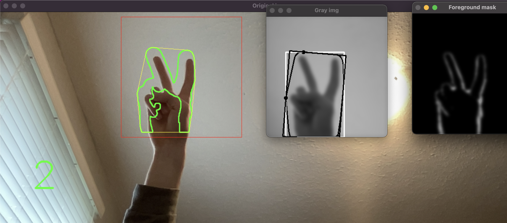

# Finger Detection

 

### C++ Program to detect hand and count the number of fingers using computer vision

## How it works

First the hand is cropped into and pre-processed by converting the image to gray and blurring.

```c++
// Crop image to the defined frame for image processing
imgCrop = imgMirror(myRoi);
// Pre-process image
cvtColor(imgCrop, imgGray, COLOR_BGR2GRAY); GaussianBlur(imgGray, imgGray, Size(23, 23), 0);
```

Using the OpenCv Background Subtractor, the hand is isolated from the background.

```c++
pMOG2->apply(imgCrop, fgMask);
```

Once isolated, the hand is again blurred, thresholded, the edges are detected using the canny edge detecting algorithm and the contours are stored.

```c++
// Pre-process and find the contours of the foreground mask
GaussianBlur(fgMask, fgMask, Size(27, 27), 3.5, 3.5);
threshold(fgMask, fgMask, thresh, maxVal, type);
Canny(fgMask, imgCanny, value, value * 2, 3);
findContours(fgMask, contours, hierarchy, RETR_TREE, CHAIN_APPROX_SIMPLE, Point(0, 0));
```

Next, the biggest contour is found (the hand), and stored.
With the contours of the hand, the convexity defects and convex hulls are determined and stored.

```c++
// Get the biggest contour
int indexOfBiggestContour = -1;
long sizeOfBiggestContour = 0;
for (int i = 0; i < contours.size(); i++)
{
    if (contours[i].size() > sizeOfBiggestContour)
    {
        sizeOfBiggestContour = contours[i].size(); indexOfBiggestContour = i;
    }
}
```

```c++
// Get convex hulls and convexity defects of hand (fingers)
convexHull(contours[i], hull[i], true);
convexityDefects(contours[i], hull[i], defects[i]);
```

Now looping through each defect, the number of fingers can be calculated

```c++
for (int j = 0; j < defects[i].size(); j++)
{
    if (defects[i][j][3] > 13 * 256)
    {
        int p_end = defects[i][j][1];
        int p_far = defects[i][j][2];
        defectPoint[i].push_back(contours[i][p_far]);
        circle(imgGray, contours[i][p_end], 3, Scalar(0, 255, 0), 2);
        count++;
    }
}
```

Once the count is determined, it can be evaluated to determine the number of fingers

```c++
a = to_string(count - 1);
if (count > 5 && count < 8)
{
    a = "5";
}
else if (count >= 8)
{
    a = "Show hand in red square";
} else if (count == 0)
{
    a = "0";
}
```

Now, the estimated number of fingers is displayed on the image, and as the contours of the hand can be drawn on the image as well as other various visualizations.

```c++
// Put the number of fingers on the image
putText(imgMirror, a, Point(75, 420), FONT_HERSHEY_SIMPLEX, 3, Scalar(0, 255, 0), 3, 8, false);
// Draw the contours of the image and the convex hulls on the drawing, image and gray
drawContours(imgMirror, contours, i, Scalar(0, 255, 0), 2, 8, vector<Vec4i>(), 0, Point(300, 0));
drawContours(drawing, contours, i, Scalar(0, 255, 0), 2, 8, vector<Vec4i>(), 0, Point());
drawContours(imgMirror, hullPoint, i, Scalar(0, 255, 255), 1, 8, vector<Vec4i>(), 0, Point(300, 0));
drawContours(drawing, hullPoint, i, Scalar(0, 255, 255), 1, 8, vector<Vec4i>(), 0, Point());
drawContours(imgGray, hullPoint, i, Scalar(0, 0, 255), 2, 8, vector<Vec4i>(), 0, Point());
// Approximate the polygon shape
approxPolyDP(contours[i], conPoly[i], 3, false);
// Get bounding reactangle of the polygon for drawing the rectangle
boundRect[i] = boundingRect(conPoly[i]);
rectangle(imgGray, boundRect[i].tl(), boundRect[i].br(), Scalar(255, 0, 0), 2, 8, 0);
minRect[i].points(rect_point);
// Draw the lines of the hand
for (int j = 0; j < 4; j++)
{
    line(imgGray, rect_point[j], rect_point[(j + 1) % 4], Scalar(0, 255, 0), 2, 8);
}
```

## Demonstration


